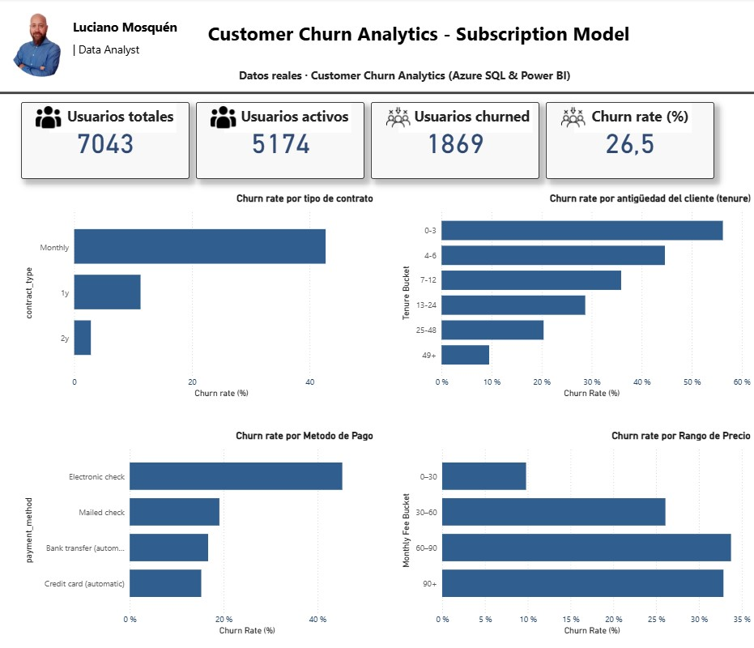

# Customer Churn Analytics – Subscription Model

Proyecto de análisis de churn sobre un modelo de suscripciones, utilizando **Azure SQL**, **Azure Data Factory** y **Power BI** para construir un flujo completo desde la ingesta de datos hasta la visualización de KPIs.

---

## 🎯 Objetivo del proyecto

Analizar el comportamiento de churn de clientes en un modelo de suscripción con el objetivo de:

- Medir el churn rate global  
- Identificar segmentos de mayor riesgo  
- Analizar el impacto de variables clave:
  - Tipo de contrato
  - Antigüedad del cliente (tenure)
  - Método de pago
  - Rango de precio mensual

El foco está puesto en **insights accionables de negocio**, no solo en visualización.

---

## 🗂️ Dataset

```text
Dataset: Telco Customer Churn
Registros: 7.043 clientes
Nivel: Cliente
```

Variables principales:
- customerID
- contract_type
- tenure_months
- monthly_fee
- payment_method
- churn_flag

---

## 🧱 Arquitectura del proyecto

```text
Azure Blob Storage
        |
        v
Azure Data Factory
        |
        v
Azure SQL Database
        |
        v
Power BI
```

---

## 🛠️ Stack tecnológico

- Azure SQL Database
- Azure Data Factory
- SQL (T-SQL)
- Power BI
- GitHub

---

## 🧮 KPIs principales

```text
Usuarios Totales        : 7.043
Usuarios Activos        : 5.174
Usuarios Churned        : 1.869
Churn Rate Global (%)   : 26,5 %
```

---

## 📊 Visualizaciones principales

### 1️⃣ Churn rate por tipo de contrato

```text
Monthly  → mayor churn
1 Year   → churn intermedio
2 Year   → churn bajo
```

Insight:
> A mayor compromiso contractual, menor probabilidad de churn.

---

### 2️⃣ Churn rate por antigüedad del cliente (Tenure)

```text
0–3 | 4–6 | 7–12 | 13–24 | 25–48 | 49+
```

Insight:
> El churn es más alto en los primeros meses y disminuye con la antigüedad.

---

### 3️⃣ Churn rate por método de pago

```text
Electronic check        → churn más alto
Mailed check
Bank transfer (auto)
Credit card (auto)     → churn más bajo
```

Insight:
> Los métodos de pago automáticos presentan mayor retención.

---

### 4️⃣ Churn rate por rango de precio mensual

```text
0–30 | 30–60 | 60–90 | 90+
```

Insight:
> Los rangos de precio más altos muestran mayor propensión al churn.

---

## 🧠 Decisiones analíticas destacadas

```text
Churn Rate (%) = Users Churned / Users Total
```

- Se evita sumar porcentajes
- Se utilizan medidas ratio y no agregaciones incorrectas
- Buckets controlados para tenure y pricing
- Separación entre tablas base, vistas SQL y medidas DAX

---

## 📁 Estructura del repositorio

```text
customer-churn-analytics/
│
├── sql/
│   ├── 01_create_tables.sql
│   ├── 02_transform_clean_data.sql
│   ├── 03_kpi_views.sql
│
├── powerbi/
│   └── customer_churn_dashboard.pbix
│
├── images/
│   └── dashboard_overview.jpg
│
└── README.md
```

---

## 🚀 Notas finales

Proyecto desarrollado como **portfolio profesional**, orientado a demostrar:

- Capacidad analítica
- Comprensión de negocio
- Uso realista de Azure
- Dominio de SQL y Power BI
- Buenas prácticas de modelado y visualización

## 📷 Vista del dashboard



